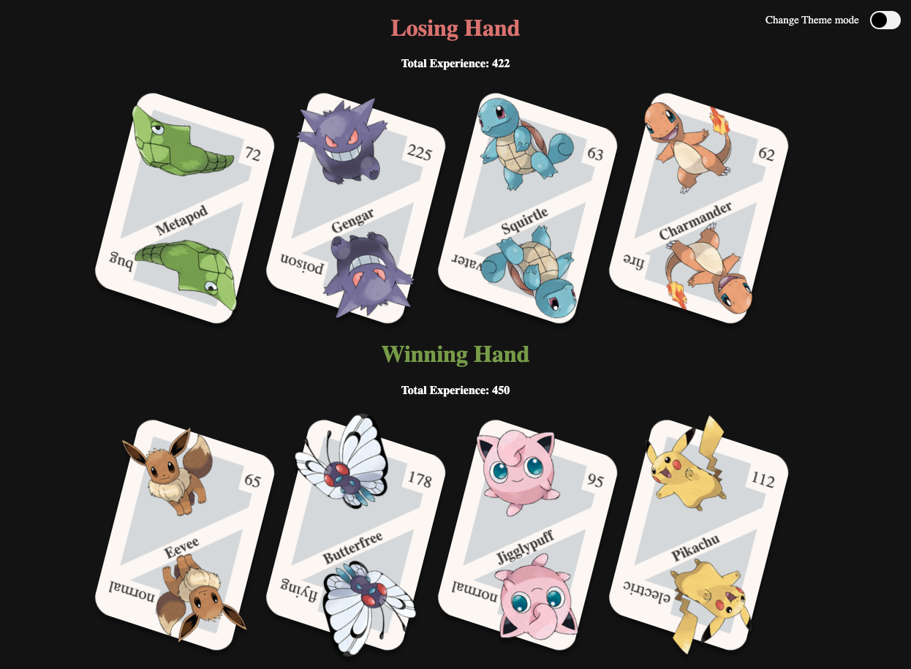

<h1 align="center">
    PokeDex
</h1>

<p align="center">
  
  
  <a href="https://www.linkedin.com/in/luiz-carlos-araujo-junior/">
    
  </a>
  
</p>

<p align="center">
  <a href="#project">Project</a>&nbsp;&nbsp;&nbsp;|&nbsp;&nbsp;&nbsp;
  <a href="#how-to-run">How to run</a>&nbsp;&nbsp;&nbsp;|&nbsp;&nbsp;&nbsp;
  <a href="#built-with">Built with</a>&nbsp;&nbsp;&nbsp;|&nbsp;&nbsp;&nbsp;
  <a href="#how-to-contribute">How to contribute</a>&nbsp;&nbsp;&nbsp;|&nbsp;&nbsp;&nbsp;
  <a href="#license">License</a>&nbsp;&nbsp;&nbsp;|&nbsp;&nbsp;&nbsp;
  <a href="#get-in-touch">Get in touch!</a>
</p>

## Project

A Pokedex game based on the following project [Pokedex](https://github.com/luiz-araujo/pokedex), bringing updates to previously used technologies.
This game divides cards between 2 players and the one with the highest score is the winner

<h1 align="center">
    
</h1>

## How to run

#### Requirements

To clone and run the application you will need:

- [Git](https://git-scm.com)
- [Node](https://nodejs.org/)
- [PNPM](https://pnpm.io)

From your command line:

```bash
# Clone this repository
$ git clone https://github.com/luiz-araujo/next-pokedex.git

# Go into the folder repository
$ cd next-pokedex

# Install dependencies
$ pnpm install
```

### Fake API

First of all, so that you have the data to display on screen, a file was created that you can use as a fake API to provide you with this data.

The project has a dependency called json-server listed in package.json, and a file called server.json that contains the data for a route /pokemons.

```bash
# To run this server you can run the following command:
$ pnpm run server
```

### Game

After running the fake api open another terminal tab and start the game

```bash
# Run
$ pnpm dev

# running on port 3000
```

## Built With

- [ReactJS](https://reactjs.org/) - A JavaScript library for building user interfaces
- [TypeScript](https://www.typescriptlang.org/) - TypeScript is a typed superset of JavaScript that compiles to plain JavaScript, it provides better autocomplete and reduces the chance of errors by comparing with simple JavaScript
- [NextJs](https://nextjs.org/) - Next.js is a JavaScript framework that simplifies the development of server-rendered React applications by offering features like server-side rendering, static site generation, automatic code splitting, and built-in routing. It allows developers to create dynamic and SEO-friendly applications with ease, providing a seamless development experience and high-performance web applications.
- [Stitches](https://stitches.dev/) - Stitches is a CSS-in-JS styling library for JavaScript applications that offers a modern API for writing and managing styles. It provides a performant and ergonomic approach to creating and composing styles, with support for features like theming, responsive design, and server-side rendering. Stitches promotes a component-based mindset and enables developers to build scalable and maintainable UI components while optimizing the application's performance.
- [Storybook](https://storybook.js.org/) - Storybook is a UI development tool that allows developers to create, view, and interact with components in an isolated manner. It provides a sandbox environment for developing and documenting components independently, making it easy to reuse and test each individual component. Storybook is widely used in web application development to help teams create and maintain a consistent and well-documented component library.
- [Jest](https://jestjs.io/) - Jest is a popular JavaScript testing framework, primarily used for unit testing applications. It provides a simple and intuitive way to write tests and assert expected behavior in JavaScript code. Jest comes with built-in features such as test runners, assertion libraries, mocking capabilities, and code coverage reporting. It is known for its ease of use, fast execution, and powerful features like snapshot testing and parallel test execution.
- [Testing Library](https://testing-library.com/) - Testing Library is a JavaScript testing utility that focuses on writing tests from a user's perspective, simulating user interactions and verifying expected UI behavior. It promotes a user-centric approach to testing and provides tools and best practices for testing UIs in a more realistic and maintainable way. It supports various JavaScript frameworks, offers intuitive APIs for querying and interacting with UI elements, and provides utilities for handling asynchronous operations and mocking dependencies. The Testing Library helps create reliable and resilient tests that closely resemble the end-user experience.
- [MSW](https://mswjs.io/) - MSW (Mock Service Worker) is a library used for mocking and intercepting HTTP requests during testing. It allows developers to simulate server responses without making actual network requests, providing a controlled testing environment. With MSW, developers can define mock handlers to intercept specific requests and return predefined responses. It helps isolate and test client-server interactions, ensuring the correctness and stability of applications that rely on server communication.
- [SWR](https://swr.vercel.app/) - SWR (Stale-While-Revalidate) is a lightweight data fetching library for JavaScript applications. It follows the stale-while-revalidate strategy, serving data from a local cache while revalidating it in the background. This approach ensures real-time data updates and improves the user experience by reducing latency. SWR handles various data fetching scenarios, optimizes network requests, and can be used with different frameworks. It provides a simple API, hooks, and utilities for fetching and managing data, making it an efficient solution for managing remote data in JavaScript applications.

## How to contribute

- Make a fork;
- Create a branch with your feature: `git checkout -b my-feature`;
- Commit changes: `git commit -m 'feat: My new feature'`;
- Make a push to your branch: `git push origin my-feature`.

After merging your receipt request to done, you can delete a branch from yours.

## TODO

- Add unit tests
- Add E2E test
- Add new game launch button
- Add more cards with next api
- Add option to select cards one by one
- Add option to choose the amount of players

## Credits

- [Layout](https://codepen.io/andybarefoot/pen/Gwggor) - Interface inspired in Playing card CSS Grid eCommerce layout by Andy Barefoot available on CodePen

## License

This project is under the MIT license. See the [LICENSE](https://github.com/luiz-araujo/next-pokedex/blob/main/LICENSE) for details.

## Get in touch!

<a href="https://www.linkedin.com/in/luiz-carlos-araujo-junior/" target="_blank" >
  
</a>&nbsp;&nbsp;&nbsp;
<a href="mailto:luizcaj@yahoo.com.br" target="_blank" >
  
</a>

---

Made with ❤️ by Luiz Araújo.
